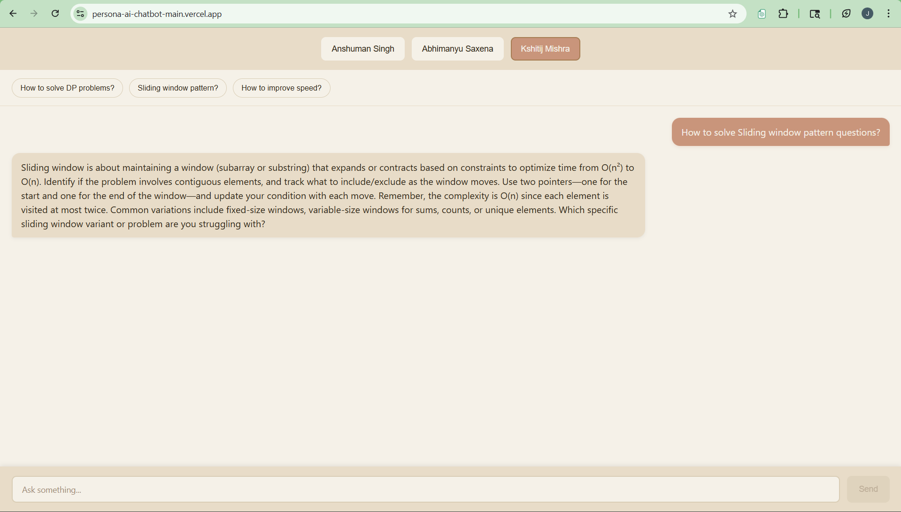
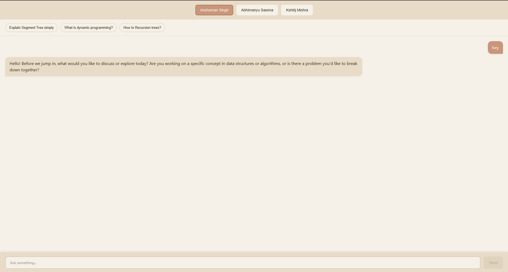
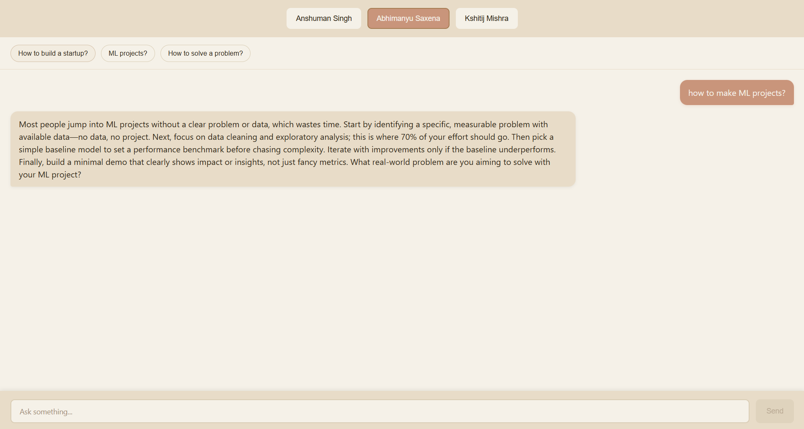

# Persona-Based AI Chatbot

This project is a prompt-engineering demo built with React and Node.js. It lets users chat with three Scaler Academy personas, each with a different response style driven by a separate system prompt.

## Overview

The application focuses on persona-driven behavior rather than a generic chatbot response. Each persona is designed to respond with a distinct tone and structure:

- Anshuman Singh: concept-first and guided
- Abhimanyu Saxena: direct and execution-focused
- Kshitij Mishra: pattern-based and technical

## Screenshots

The screenshots below are included in the repository and show the current UI.





## Features

- Switch between three personas
- Persona-specific suggestion chips
- Typing indicator while the response is loading
- Chat reset when the persona changes
- Responsive layout for desktop and mobile

## Tech Stack

- Frontend: React, Vite, plain CSS
- Backend: Node.js, Express
- API: OpenAI-compatible AICredits endpoint

## Project Structure

```bash
persona-ai-chatbot/
├── client/
├── server/
├── prompts.md
├── reflection.md
└── README.md
```

## Setup

### 1. Clone the repository

```bash
git clone <your-repo-link>
cd persona-ai-chatbot
```

### 2. Backend setup

```bash
cd server
npm install
```

Create a `.env` file in the `server` folder:

```env
API_KEY=your_api_key_here
API_BASE_URL=your_url_here
```

Start the backend:

```bash
npm start
```

### 3. Frontend setup

```bash
cd client
npm install
npm run dev
```

## Notes

- API keys are not committed to the repository
- Use the `.env.example` file in the `server` folder as a reference
- Start the backend before opening the frontend

## What This Project Demonstrates

- Prompt design for distinct personas
- Response control through system instructions
- Basic frontend and backend integration
- Practical use of LLM-based conversation flows

## Acknowledgement

This project was completed as part of the Prompt Engineering module at [Scaler School of Technology](https://www.scaler.com/).
